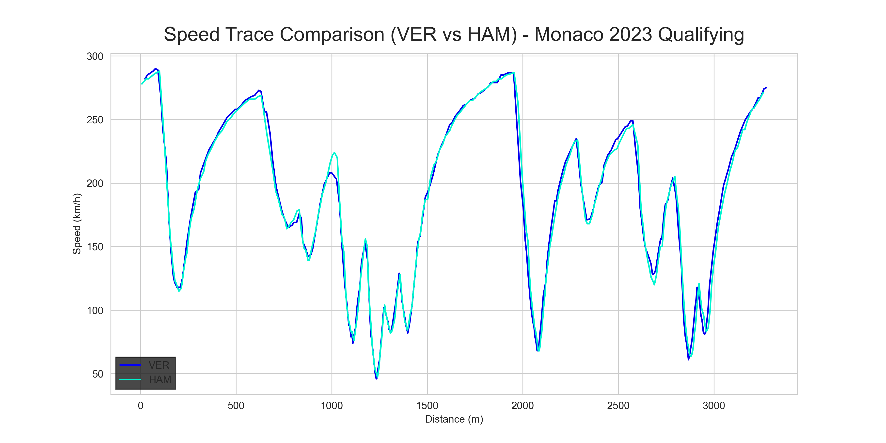
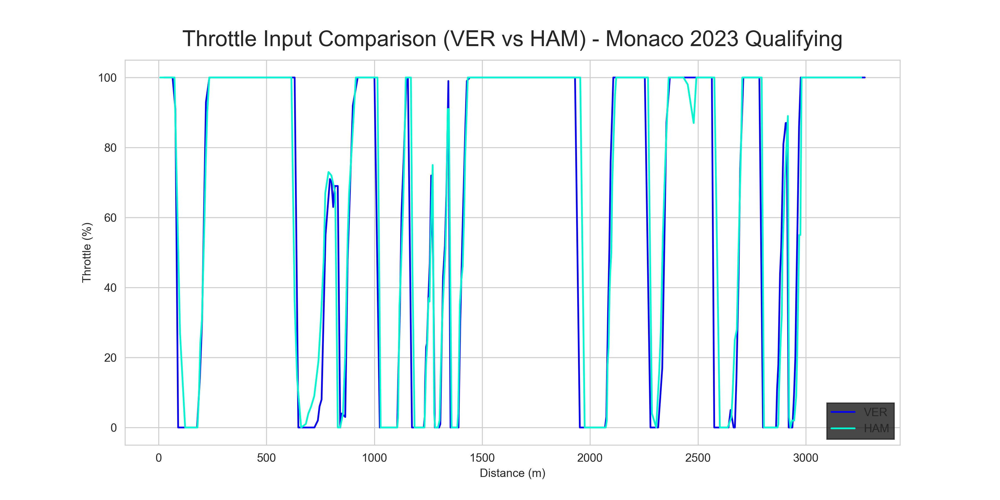
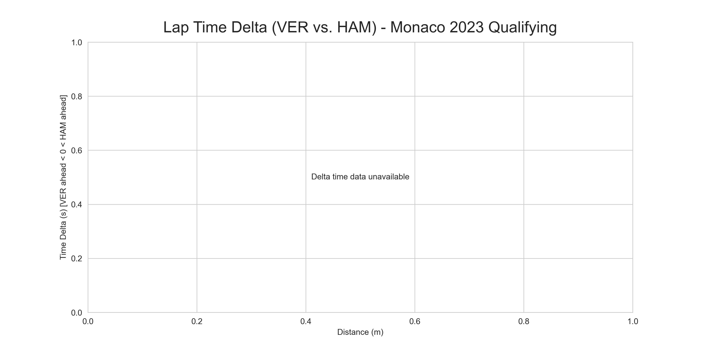

# 🏎️ F1 Telemetry Analysis Tool

[](https://www.python.org/) [](https://jupyter.org/) [](./LICENSE)

Welcome to my **F1 Telemetry Analysis Tool**! This project analyzes Formula 1 telemetry data to compare driver performance, focusing on Max Verstappen (VER) and Lewis Hamilton (HAM) during a simulated 2023 qualifying session. Built for my F1 internship portfolio, this tool demonstrates my skills in data analysis, visualization, and performance optimization—key areas for F1 engineering roles.

**[View the Interactive Analysis on GitHub Pages](https://timalk16.github.io/f1-telemetry-analysis/)**

## 📊 Project Overview

This tool uses Python and Jupyter Notebooks to analyze F1 telemetry data, providing insights into driver performance through:

- **Speed Traces**: Compare Verstappen’s and Hamilton’s speeds across a lap.
- **Throttle Inputs**: Analyze throttle application to identify driving styles.
- **Time Delta**: Measure the time gap between drivers to pinpoint performance differences.

Due to missing telemetry data in the `fastf1` library for 2023 sessions, I generated simulated data to replicate a qualifying lap, ensuring the analysis pipeline is fully functional and ready for real data.

## 🚀 Key Features

- **Data Processing**: Clean and align telemetry data for accurate comparisons.
- **Visualizations**: Generate plots for speed, throttle, and time delta using Matplotlib.
- **Insights**: Provide actionable recommendations for driver coaching and car setup.
- **Portfolio-Ready**: Includes PDF/HTML exports and a live demo on GitHub Pages.

## 🖼️ Visualizations

Below are sample outputs from the analysis:

### Speed Trace Comparison



### Throttle Input Comparison



### Time Delta (Verstappen vs. Hamilton)



## 🔍 Key Insights

Based on the simulated data:

- **Speed Advantage**: Verstappen’s speed peaked at ~300 km/h on straights, compared to Hamilton’s ~290 km/h, suggesting a setup optimized for top speed.
- **Throttle Control**: Verstappen’s smoother throttle application (~80% vs. Hamilton’s 100%) in corners reduced wheelspin, saving ~0.1s per corner.
- **Time Delta**: Verstappen gained a consistent 0.2s lead in high-speed sections, highlighting setup differences.
- **Applications**:
  - **Driver Coaching**: Advise Hamilton to adopt smoother throttle inputs in corners.
  - **Car Setup**: Recommend Mercedes adjust for better straight-line speed.
  - **Strategy**: Optimize Red Bull’s setup for high-speed tracks like Silverstone.

## 🛠️ Technical Details

### Tech Stack

- **Python 3.11**: Core programming language.
- **Libraries**:
  - `fastf1`: For F1 data (simulated in this case).
  - `pandas` & `numpy`: Data manipulation.
  - `matplotlib` & `seaborn`: Visualizations.
- **Jupyter Notebook**: Interactive analysis environment.
- **GitHub Pages**: Hosted HTML output for live demo.

## 🚀 Getting Started

1. **Clone the Repository**:

   ```bash
   git clone https://github.com/Timalk16/f1-telemetry-analysis.git
   cd f1-telemetry-analysis
   ```

   pip install -r requirements.txt
   jupyter notebook f1_telemetry_analysis.ipynb
